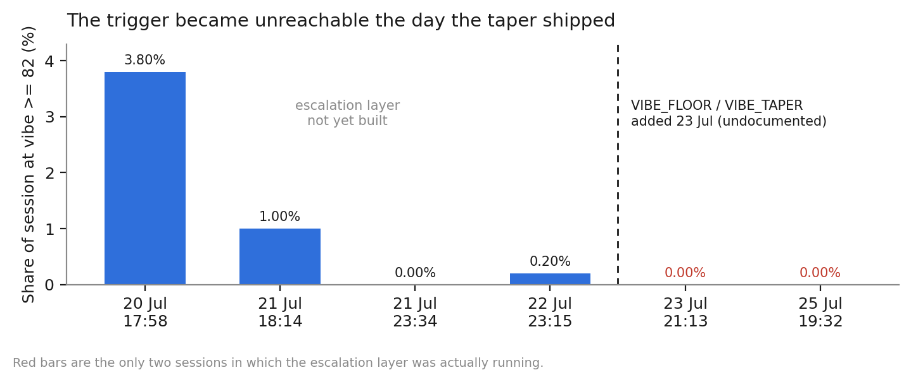
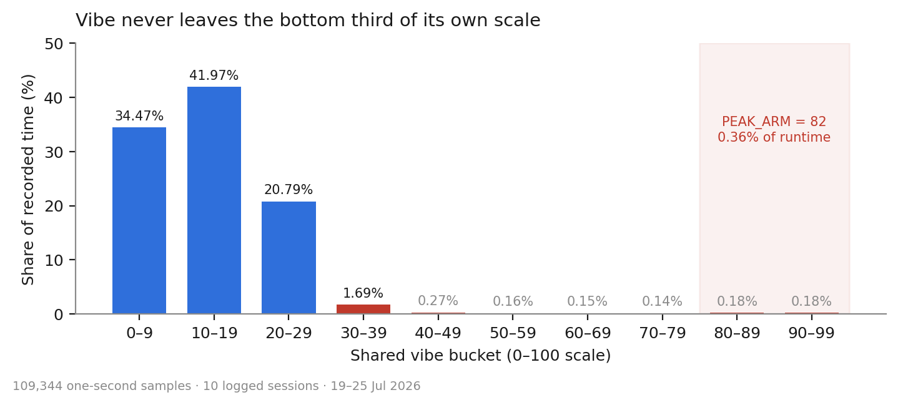
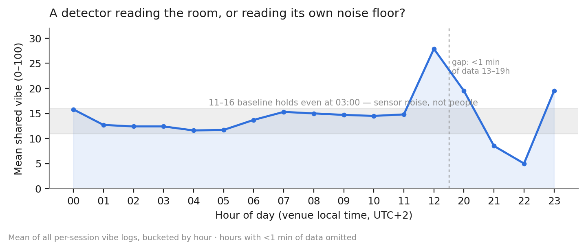

\newpage

# Summary

This report evaluates **Part II — VIBEMAP engine** of `VIBE_SPEC.md` against telemetry
captured during live exhibition use. It is not a proposal or a simulation: every figure
below is measured from logs the unit wrote to disk across 17 recorded sessions between
19 and 25 July 2026.

| Measure | Value |
| --- | --- |
| Recorded sessions | 17 (10 with vibe logging) |
| Runtime logged | 49.2 hours |
| Vibe samples at 1 Hz | 109,344 |
| Snapshots written | 22,801 (21 GB) |
| Subject IDs tracked | 20,567 |
| Logged events | 31,013 |
| Longest unattended run | 21 h 43 min, no crash |

The engine is **operationally sound**. It runs for a day at a time without failing, the
gateway handshake recovers from dropouts, and the gesture-bonus path fires constantly.
The problem is **calibration**, and specifically a calibration change made after the spec
was written.

> **Headline finding.** An undocumented noise-floor and gamma stage
> (`VIBE_FLOOR = 0.15`, `VIBE_TAPER = 1.2`) was added to the pipeline on 23 July. Before
> that date the meter crossed 82 regularly — 3.8% of one exhibition evening. After it, in
> 30.6 hours and 47,747 samples, the meter crossed 82 **exactly zero times**. The
> escalation event that the whole show builds toward has therefore never fired from live
> crowd data, because the only sessions in which that event existed are also the only
> sessions in which its threshold became unreachable.

# Method

Data provenance:

- **Source**: the unit's own auto-save folder, written by `flushVibeLog()` and
  `saveTextToFolder()` as documented in Part II, *Outputs & logging*.
- **Files**: 28 CSV logs — `vibe_<session>.csv` (the 1 Hz vibe track),
  `observer_<session>_log.csv` (the event log), and a cross-day `vibe_archive.csv`.
- **Tooling**: `tools/analyze_sessions.py`, which rolls every session into a single JSON
  report. All aggregates below are reproducible by re-running it over the folder.
- **Detector**: every logged session ran in **motion mode** (frame differencing), the
  default described in Part II. No session used AI person mode, so Part I of the spec is
  out of scope here.

Two caveats on interpretation. First, these sessions are not a controlled experiment —
they mix calibration runs, empty-room soak tests and live exhibition hours, and the
report separates these where it matters. Second, hours 13:00–19:00 hold under one minute
of data in total and are excluded from the hour-of-day figure.

# Conformance against the spec

| Spec reference | What the spec states | What the field data shows | Verdict |
| --- | --- | --- | --- |
| II, *Base activity* | "a single person crossing (~25% moving) reads ~0.4, so a maxed meter needs sustained, whole-frame motion" | 97.2% of runtime below 30; 0.36% at or above 80 | Behaves as written, but the resulting range is unusable |
| II, *Attack / release* | attack `1.6/s`, release `0.5/s` | A flat 11–16 baseline persists at every hour, including 03:00 | Slow release over a noise floor keeps the meter permanently lit |
| II, *Per-section vibe* | each third gets an independent meter at gain `2.4` | One third absorbed roughly 90% of scored energy on three nights | Mapping or gain is skewed, not the crowd |
| II, *Gesture and move bonuses* | heart +45, V +22, Y +9, shape bonus | `DANCE_MOVE` is the most frequent event in the corpus at 8,760 | Conforms; the healthiest part of the pipeline |
| II, *Network / multi-venue sync* | `sharedVibe = max(local, peers)` | `peers = 0` in **all 17 sessions** | Never exercised; unverified specification |
| II, *Outputs and logging* | 1 Hz `{shared, local, peers, l, m, r}` | 109,344 samples, schema matches, plus per-section scores | Conforms |
| — | *(not in spec)* | `taperActivity()`, peak/takeover mode, timed warning, creature cast | Four behaviours the spec does not describe |

# Finding 1 — an undocumented taper closed off the top of the scale



Part II documents a five-step pipeline in which `currentActivity()` feeds directly into
the sensitivity scaling and the asymmetric EMA. The running implementation inserts an
extra stage between the two:

```
t = (activity - VIBE_FLOOR) / (1 - VIBE_FLOOR)
activity' = t <= 0 ? 0 : min(1, t) ^ VIBE_TAPER
```

with `VIBE_FLOOR = 0.15` and `VIBE_TAPER = 1.2`. The intent was reasonable — sensor
speckle was inflating the meter, and high vibe was meant to be harder to earn. The
measured effect was categorical rather than gradual:

| Period | Sessions | Samples | Time at vibe >= 82 |
| --- | ---: | ---: | ---: |
| Before 23 Jul (pre-taper) | 4 | 61,475 | 0.56% |
| From 23 Jul (post-taper) | 6 | 47,869 | **0.00%** |

Nothing about the venue changed between those two periods; the 22 July and 25 July
sessions are both long evening runs on the same feeds. What changed was the transfer
function. Combined with the escalation layer having been built during the same window,
the result is that the trigger and its unreachability shipped together and the condition
has never been observed in production.

# Finding 2 — the scale is compressed into its bottom third



Even setting the taper aside, the activity function specified in Part II is

```
activity = blob * 1.5 + min(movers, 6) * 0.07
```

The spec is candid that this is "deliberately gentle". The field data quantifies how
gentle: a 25% frame-coverage crossing reads about 0.4, and the sustained whole-frame
motion needed to approach 1.0 does not occur on a monitor feed of dancers. The
consequences compound downstream — per-section creature stages past the midpoint rarely
appear, and the upper half of a 0–100 scale carries no information.

# Finding 3 — the baseline is noise, not people



A crowd metric should approach zero in an empty room. Instead the mean sits between 11
and 16 at nearly every hour of the cycle, including the small hours when the space is
empty. That flatness is the signature of a detector integrating sensor speckle rather
than bodies, and it is what the taper was introduced to suppress.

The taper did not eliminate it, which suggests `VIBE_FLOOR` is set roughly half as high
as it needs to be. Only three narrow windows — midday, 20:00 and 23:00 — rise clearly
above the noise band, and those are the genuine human peaks.

# Finding 4 — one section is eating the show

Part II describes three independent section meters feeding a per-section leaderboard.
Accumulated vibe-seconds per session tell a different story:

| Session | Left | Middle | Right | Dominant share |
| --- | ---: | ---: | ---: | --- |
| 20 Jul 17:58 | 2,582 | 145 | 23,524 | Right, 90% |
| 21 Jul 18:14 | 1,235 | 5 | 14,345 | Right, 92% |
| 21 Jul 23:34 | 250 | 334 | 7 | Middle, 57% |
| 22 Jul 23:15 | 13,667 | 1,525 | 152,058 | Right, 91% |
| 23 Jul 21:13 | 625 | 139 | 21 | Left, 80% |
| 25 Jul 19:32 | 1,491 | 666 | 715 | Left, 52% |

A single third taking about 90% of the energy on three nights and near zero on another
is not plausible crowd behaviour. The likely cause is the section-to-monitor mapping:
when a section is bound to a specific monitor quad rather than a geometric third, all
motion within that monitor is attributed to one section, and a busy screen monopolises
the leaderboard. Until this is re-checked, per-section scores should not be read as a
measurement of where the crowd actually is.

# Finding 5 — what is working

Three parts of the spec are validated by the data and should not be touched:

- **The gesture layer.** `DANCE_MOVE` fired 8,760 times. The bonus mechanism described
  in Part II is the most reliably triggered path in the entire system, and it is what
  carried the piece while the vibe meter sat flat.
- **The logging contract.** The 1 Hz night log and the cross-day archive match the
  documented schema exactly, which is the only reason this report was possible.
- **Gateway resilience.** 2,097 successful reachability probes against 8 failures, and
  30 successful feed connections against 12 handshake retries and 6 hard failures. The
  WHEP-then-WebSocket fallback is doing its job.

# Finding 6 — the spec has drifted from the implementation

Four behaviours now exist in the running app that Part II does not describe. Each should
be folded into the spec or explicitly declared out of scope:

1. **Activity tapering** — `taperActivity()`, the subject of Finding 1, sitting between
   steps 1 and 2 of the documented pipeline.
2. **Peak / takeover mode** — an arming threshold of 82 held for 1.2 s triggers a
   three-count and a 14-second forced-maximum window, re-arming only below 60. An entire
   event layer absent from the spec, and dead code in practice.
3. **A scheduled warning event** on a fixed 120-second timer, independent of vibe.
4. **The performer cast** — Part II states that per-section vibe "drives the trio of
   green-screen performers". Those have been replaced by a three-stage creature cast
   whose stage is selected by section vibe.

Items 2 and 3 together produce the report's most uncomfortable observation. The
crowd-driven escalation fired **0** times; the clock-driven warning fired **152** times
over the same period. Every dramatic beat the installation has produced so far came from
a timer rather than from the room.

# Recommended amendments

Ordered by impact on the exhibited work.

**1. Retune the taper before anything else.** `VIBE_FLOOR = 0.15` with
`VIBE_TAPER = 1.2` currently removes the entire top of the range. Either lower the gamma
to 1.0 and keep the floor, or keep the gamma and drop the arming threshold — but the two
were tuned independently and their product was never checked against the trigger.

**2. Rescale the activity mapping, or lower the trigger.** Two options:

- *Cheap:* set the arming threshold to 35–40. On the measured distribution that makes
  the event reachable a few times per busy hour instead of never.
- *Correct:* rescale `currentActivity()` so a genuinely busy room maps to 70–100.
  Raising the blob coefficient from 1.5 toward roughly 3.0 would place observed peaks
  near the top of the scale while leaving the empty-room baseline where it is.

**3. Raise the noise floor to about 0.25–0.30** so an empty room reports near zero,
which is what a crowd metric should do — and document the value in Part II either way.

**4. Audit the section-to-monitor mapping** before the per-section leaderboard is used
for anything, and consider normalising each section by its own area.

**5. Document the taper and the escalation layer** in Part II so the spec again matches
the implementation, and record calibration provenance for the new constants the way
Parts I and II already do for the originals.

**6. Either exercise or descope multi-venue sync.** The `sharedVibe = max(local, peers)`
path has never run with a peer present across 49 hours.

\newpage

# Appendix A — session detail

All ten sessions that produced vibe telemetry. "% dead" is the share of samples below
vibe 5. Seven further short runs on 19–20 July predate vibe logging and contributed 89
snapshots and 94 subject IDs during setup.

| Started            | Min | Samples | Mean | Peak | >=50 | >=82 | Dead | Snaps | Faces | FPS |
| ------------------ | ------: | ------: | ---: | ---: | ---: | ---: | ---: | ------: | ------: | ---: |
| 20 Jul 17:58 | 134.1 | 6,138 | 15.8 | 100 | 6.80 | 3.80 | 27.7 | 386 | 192 | 56 |
| 21 Jul 18:14 | 63.2 | 3,617 | 12.8 | 98 | 2.10 | 1.00 | 25.4 | 469 | 0 | 24 |
| 21 Jul 23:34 | 222.6 | 12,945 | 12.8 | 38 | 0.00 | 0.00 | 0.2 | 2,456 | 124 | 78 |
| 22 Jul 23:15 | 679.4 | 38,775 | 16.1 | 100 | 0.50 | 0.20 | 2.9 | 7,281 | 1,231 | 31 |
| 23 Jul 10:34 | 13.3 | 25 | 13.7 | 31 | 0.00 | 0.00 | 12.0 | 106 | 98 | 177 |
| 23 Jul 10:48 | 0.4 | 19 | 3.8 | 28 | 0.00 | 0.00 | 89.5 | 120 | 114 | 155 |
| 23 Jul 20:53 | 2.3 | 59 | 7.7 | 27 | 0.00 | 0.00 | 39.0 | 171 | 118 | 147 |
| 23 Jul 21:13 | 0.4 | 19 | 0.6 | 5 | 0.00 | 0.00 | 94.7 | 3 | 2 | 220 |
| 23 Jul 21:13 | 1,302.8 | 16,945 | 17.8 | 61 | 0.00 | 0.00 | 0.5 | 2,841 | 314 | 113 |
| 25 Jul 19:32 | 531.5 | 30,802 | 7.1 | 100 | 0.70 | 0.00 | 60.4 | 8,879 | 822 | 77 |

Columns: `Min` is session length in minutes, `>=50` / `>=82` / `Dead` are the share of
samples above 50, above 82 and below 5 respectively, `Faces` counts snapshots carrying
the clean-face marker.

Cross-day archive coverage, written by the retention job:

| Day | Samples | Minutes | Mean | Peak |
| --- | ---: | ---: | ---: | ---: |
| 21 Jul | 10,775 | 179.6 | 13.7 | 98 |
| 22 Jul | 31,843 | 530.7 | 9.9 | 53 |
| 23 Jul | 18,376 | 306.3 | 16.3 | 39 |

# Appendix B — event census

Counts are of **log events**, which is not the same as derived counts elsewhere in this
report. `CLEAN_FACE` fired 704 times as an event, while 3,019 saved snapshots carry the
clean-face marker in their filename; the event is emitted once per qualifying detection
rather than once per written frame.

| Event | Count | Meaning |
| --- | ---: | --- |
| `DANCE_MOVE` | 8,760 | Gesture or dance move scored |
| `DIAG` | 7,813 | Detector diagnostic sample |
| `NEW_SUBJECT` | 6,139 | New tracked subject ID |
| `SNAPSHOT` | 5,116 | Frame written to disk |
| `GATEWAY_OK` | 2,097 | go2rtc gateway reachable |
| `CLEAN_FACE` | 704 | Frontal, level, confident face |
| `BLOOD_MOON` + `CAST_WARNING` | 91 + 61 | Scheduled 120-second warning, before and after rename |
| `MONITOR_SET` | 68 | Monitor quad placed or moved |
| `FEED_CONNECT` | 30 | Sentinel / Sparkle stream connected |
| `FEED_TRY` / `FEED_TRY_FAIL` | 18 / 12 | Transport attempt and handshake retry |
| `MONITOR_ADDED` | 15 | New monitor region defined |
| `SESSION_START` | 12 | Session began |
| `GATEWAY_FAIL` | 8 | Gateway unreachable |
| `CYCLE_MODE` | 8 | Cycle mode toggled |
| `FEED_ERROR` | 6 | Feed gave up after both transports |
| `PEAK_MODE` | **0** | Crowd-driven escalation event |

# Appendix C — storage

Capture ran at 463 snapshots per hour, averaging roughly 0.9 MB each — about 9 GB per 24
hours of runtime. The archive stands at 21 GB. Since 86.8% of snapshots carry no clean
face, face-gated retention is the obvious reduction.
